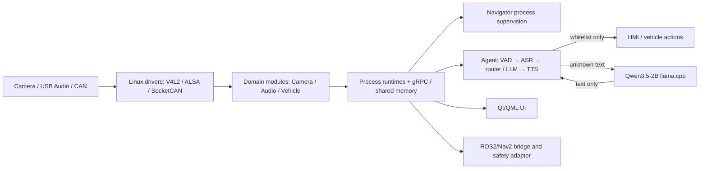

# Cockpit V1 架构与面试要点

## 项目亮点

1. V4L2 MMAP RAW10 → bounded queue → CPU Software ISP → BGRx shared memory → Qt UI。
2. 720p30实测P95 5.61ms、0 drop/gap；1080p30实测P95 11.22ms。
3. 多进程Navigator监管Camera/Audio/Agent/HMI等模块，具备restart limit与状态快照。
4. 白名单动作与LLM文本路径分离，LLM不能直接shell、RPC或CAN。
5. Jetson 8GB上并发Camera、Audio、SenseVoice、Kokoro、2B GPU LLM、Qt UI和ROS2/Nav2。
6. kill llama-server 后Agent存活并5.2秒恢复；kill Camera模块后Navigator自动重启、UI不中断。
7. CI覆盖Debug/Release、ASan/UBSan、TSan-camera、ROS2/Nav2和有界OTA生命周期。

## 面试问题

1. 为什么Camera使用采集线程与ISP线程之间的有界队列？
2. 为什么恢复成功必须等待当前generation的首个processed frame？
3. 720p、1080p和原生8MP模式如何做性能取舍？
4. 为什么CameraFrame用shared memory，而控制接口用gRPC？
5. 为什么白名单动作不能由LLM直接产生任意调用？
6. Agent如何处理LLM timeout、TTS timeout和并发会话？
7. Navigator的模块startup timeout为什么必须覆盖模型加载时间？
8. managed llama-server为什么需要父进程死亡信号和独立进程组？
9. 如何判断RSS增长是模型/ROS2冷启动平台化，还是内存泄漏？
10. 为什么KWS blocker不能用mock结果替代真实Jetson结论？
11. UI人工测试发现的问题与Qt offscreen测试有什么不同？
12. ROS2 test stack为什么必须明确fake chassis不输出CAN？
