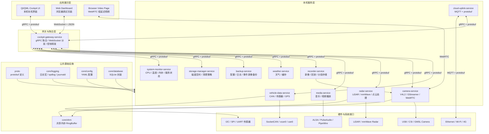
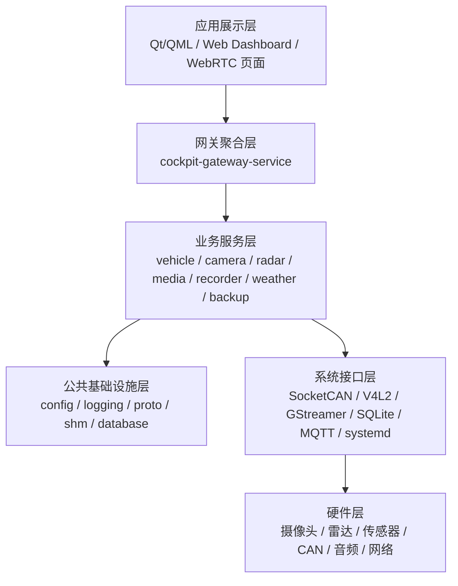
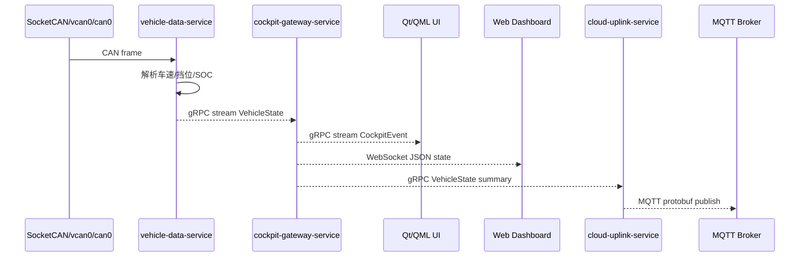
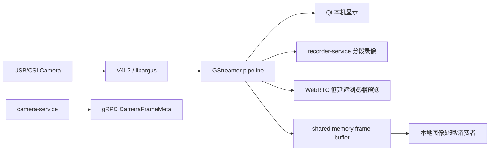
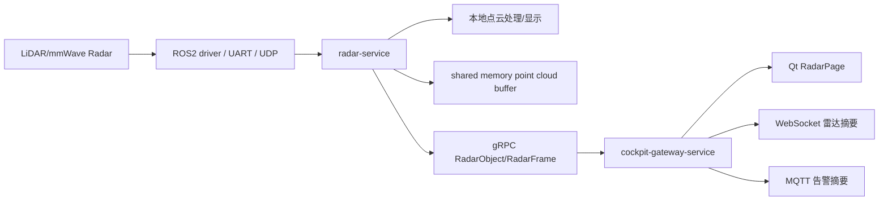
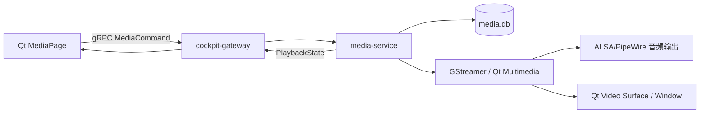
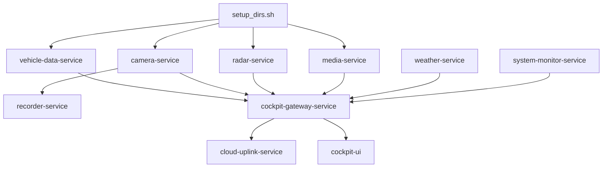

# Jetson 智能车机 / 座舱原型系统架构设计文档

> 文档状态：v0.3 总体蓝图（结合当前项目进展持续修订）  
> 当前文件：`docs/architecture_refined_v0.3.md`  
> 项目名称：`cockpit-system`  
> 目标平台：Jetson Orin Nano / Orin NX / 普通 Linux 开发机  
> 主要技术：Qt/QML、C++17、gRPC、protobuf、MQTT、GStreamer、V4L2、WebSocket、WebRTC、共享内存、SocketCAN、SQLite、systemd

---

## 0. 文档边界与当前阶段说明

本文档定位为 `cockpit-system` 的总体架构蓝图，用于统一系统目标、模块边界、通信方式、工程规范和后续 AI 辅助编码规则。

当前项目已经进入可运行骨架和基础模块开发阶段。旧项目审计已记录在
`docs/reference_projects.md` 与 `docs/reference_code_audit.md`。当前先完成 Jetson 本机链路，
云端前后端仅作为未来可选扩展；具体执行顺序以 `docs/implementation_status.md` 为准。

当前文档遵循以下边界：

1. 保留完整系统蓝图，但不要求一次性实现所有模块。
2. 版本路线仅作为阶段草案，具体开发顺序待旧项目参考完成后确认。
3. 旧项目代码优先作为工程实践参考，不默认直接复制。
4. 主工程构建系统暂定为 CMake + Ninja，Xmake 可用于小 demo 和技术验证。
5. 车机 UI、服务通信、车云通信、摄像头、雷达、共享内存等模块需要分阶段落地。
6. 所有 AI 生成代码必须服从本文档中的模块边界、工程规范和代码规则。


## 1. 项目目标

本项目目标是构建一个接近真实车机/智能座舱的软件原型系统，覆盖本机车机 UI、车辆数据接入、摄像头显示、雷达/传感器数据接入、媒体播放、天气、录像回放、日志、备份、车云通信等能力。

项目不是单纯做一个 Qt 仪表盘，而是做一个分层清晰、服务化、可扩展、便于后续 AI 辅助编码的车载软件系统。

核心目标：

1. 使用 Qt/QML 实现本机车机 UI。
2. 使用 C++ 服务实现车辆数据、摄像头、雷达、媒体、天气、录像、日志、备份等功能。
3. 本机服务之间使用 gRPC + protobuf 通信。
4. 车端到云端使用 MQTT + protobuf 上报。
5. 视频帧、点云、高频大块数据使用共享内存传输，gRPC 只传元数据。
6. 摄像头本机显示走 V4L2 / GStreamer / Jetson libargus。
7. 浏览器低延迟视频预览走 WebRTC。
8. 浏览器实时调试页面走 WebSocket。
9. 日志系统作为所有模块穿插使用的基础设施。
10. 使用 YAML 管理日志等级、共享内存大小、服务端口、MQTT、摄像头、CAN、录像策略等运行时配置。

### 1.1 架构设计原则

1. **先分层，再编码**：UI、网关、业务服务、公共基础设施、系统接口、硬件访问必须分层，不允许 UI 直接访问硬件。
2. **先接口，后实现**：跨模块通信优先定义 protobuf、配置项、输入输出和错误码，再写具体实现。
3. **先用户态，后驱动**：CAN、传感器、摄像头、雷达先用用户态方案跑通，后续再补 Linux 驱动、设备树和内核模块。
4. **先 mock，后真设备**：新模块先支持 mock 数据或模拟器，确认链路后再接真实硬件。
5. **大数据和控制面分离**：车辆状态、控制命令走 gRPC；视频帧、点云等大块数据走共享内存或媒体管线。
6. **日志和配置是基础设施**：所有服务必须统一使用 `core/logging` 和 `core/config`，避免每个模块自行实现一套。
7. **工程工具链先统一**：格式化、静态检查、测试、Sanitizer、CI、打包部署规则必须在项目早期确定。
8. **旧项目经验优先沉淀为规则**：旧项目中的启动流程、日志习惯、网络重连、打包脚本、协议处理方式，优先总结为文档和模板，再决定是否复用代码。


---

## 2. 总体架构图



---

## 3. 技术选型总表

| 功能 | 技术选型 | 说明 |
|---|---|---|
| 本机车机 UI | Qt/QML + C++ | QML 做界面，C++ QObject 做数据模型和 gRPC client |
| 本机服务通信 | gRPC + protobuf | 强类型、接口清晰、支持 streaming |
| 车云通信 | MQTT + protobuf | 适合设备上报、弱网重连、topic 管理、QoS |
| 浏览器实时页面 | WebSocket + JSON | 适合调试页面、日志流、状态看板 |
| 浏览器低延迟视频 | WebRTC | 适合浏览器实时预览摄像头 |
| 摄像头本机显示 | V4L2 / GStreamer / libargus | USB 走 V4L2，Jetson CSI 优先 GStreamer + nvargus |
| 视频/点云大数据 | shared memory + gRPC metadata | 共享内存放数据本体，gRPC 传元数据和控制命令 |
| CAN | SocketCAN / can-utils | 支持 vcan0 模拟和 can0 真机 |
| 传感器 | I2C / SPI / UART / IIO | 先用户态读取，后续补 Linux 驱动和设备树 |
| 雷达 | ROS2 driver / UDP / UART | 初期只做本地处理和摘要展示 |
| 媒体播放 | GStreamer / Qt Multimedia | Jetson 上优先 GStreamer |
| 录像回放 | GStreamer + SQLite index | 分段录像，按时间检索 |
| 数据库 | SQLite | 适合本机嵌入式数据、媒体索引、事件索引 |
| 日志 | spdlog + rotating file + journald | 每个服务独立日志文件，支持滚动；glog 可作为备选 |
| 配置 | yaml-cpp + YAML | 管理运行参数、模块日志等级、共享内存大小等 |
| 协议 | protobuf | 本机 gRPC 与车云 MQTT 的结构化数据协议 |
| RPC 通信 | gRPC + protobuf | 本机服务通信、Qt UI 订阅状态、控制命令下发 |
| MQTT 客户端 | Paho MQTT C++ / Mosquitto C API | 车端到云端上报与命令下发 |
| 服务管理 | systemd | 开机自启、崩溃重启、journalctl 调试 |
| 构建 | CMake + Ninja | C++ 多服务项目主构建系统和构建后端 |
| 依赖管理 | Conan，vcpkg 备选 | 不建议多个依赖管理工具混用 |
| 开发环境 | Docker | 统一开发环境、CI 环境和依赖版本 |

---

## 4. 分层设计



### 4.1 应用展示层

包括：

- `apps/cockpit-ui`：本机 Qt/QML 车机界面。
- `apps/web-dashboard`：浏览器调试页面。
- 浏览器 WebRTC 视频页面：可合并到 `web-dashboard`。

原则：

- QML 不直接访问硬件。
- QML 不直接连所有服务。
- QML 通过 C++ QObject 封装 gRPC client。
- 浏览器状态页使用 WebSocket。
- 浏览器视频使用 WebRTC，不用 WebSocket 传视频帧。

### 4.2 网关聚合层

核心服务：`cockpit-gateway-service`。

职责：

1. 聚合各服务状态。
2. 给 Qt UI 提供统一 gRPC 接口。
3. 给 Web Dashboard 提供 WebSocket 接口。
4. 接收 UI 控制命令并转发到底层服务。
5. 对数据进行降频和过滤。
6. 屏蔽底层服务变化。

### 4.3 业务服务层

每个服务只做自己的事情，避免大杂烩。

| 服务 | 职责 |
|---|---|
| `vehicle-data-service` | CAN、传感器、GPS、车辆状态聚合 |
| `camera-service` | 摄像头采集、本机显示、WebRTC、帧元数据 |
| `radar-service` | 激光雷达/毫米波雷达接入、目标摘要、点云本地处理 |
| `media-service` | 音乐、视频、播放列表、音量、进度 |
| `recorder-service` | 摄像头录像、分段保存、录像索引、回放 |
| `weather-service` | 天气请求、缓存、城市/GPS 定位 |
| `backup-service` | 配置、日志、事件录像、数据库备份 |
| `storage-manager-service` | 磁盘空间、旧录像清理、日志清理、缓存清理 |
| `system-monitor-service` | CPU、内存、温度、网络、服务健康状态 |
| `cloud-uplink-service` | MQTT 上报、命令下发、云端协议适配 |

### 4.4 公共基础设施层

| 模块 | 目录 | 说明 |
|---|---|---|
| 配置 | `core/config` | 读取 YAML，提供类型化配置 |
| 日志 | `core/logging` | 封装日志宏、日志等级、滚动文件 |
| 协议 | `proto` | protobuf 和 gRPC service 定义 |
| 共享内存 | `core/shm` | RingBuffer、Writer、Reader、metadata |
| 数据库 | `core/database` | SQLite 封装、表初始化、DAO |
| 工具 | `core/utils` | 时间戳、线程、文件、字符串、错误码等 |

---

## 5. 核心数据链路

### 5.1 车辆状态链路



频率建议：

| 数据 | 推荐频率 |
|---|---|
| CAN 原始采集 | 50Hz ~ 100Hz |
| vehicle-data-service 内部状态 | 20Hz ~ 50Hz |
| Qt UI 显示 | 10Hz ~ 30Hz |
| WebSocket 调试页面 | 1Hz ~ 10Hz |
| MQTT 云端上报 | 1Hz ~ 5Hz |

### 5.2 摄像头链路



原则：

- 本机显示：GStreamer / V4L2。
- 浏览器低延迟：WebRTC。
- 不用 WebSocket 推视频帧。
- 共享内存只用于视频帧本体。
- gRPC 只传 `frame_id`、`timestamp`、`format`、`shm_name`、`offset`、`size` 等元数据。

### 5.3 雷达/点云链路



原则：

- 点云先本地处理，不急着上云。
- UI 第一版只显示最近障碍物、目标数量、角度、距离。
- 云端只上传摘要和告警，不上传完整点云。

### 5.4 媒体播放链路



### 5.5 录像回放链路

```mermaid
flowchart LR
    CAM[camera-service] --> GST[GStreamer encoded stream]
    GST --> REC[recorder-service]
    REC --> FILES[/data/recordings 分段 mp4]
    REC --> DB[(recordings.db 录像索引)]
    QT[Qt PlaybackPage] -->|gRPC 查询/播放命令| GW[cockpit-gateway]
    GW --> REC
    REC --> MEDIA[media-service 播放录像]
```

### 5.6 日志链路

```mermaid
flowchart TB
    S1[vehicle-data-service]
    S2[camera-service]
    S3[radar-service]
    S4[media-service]
    S5[recorder-service]
    S6[cloud-uplink-service]

    LOG[core/logging\nLOG_INFO / LOG_WARN / LOG_ERROR]
    FILES[/data/logs/*.log\n滚动日志文件]
    JOURNAL[journald]
    EVENTDB[(events.db\n关键事件)]
    LOGSVC[log-service\n查询/导出/压缩/清理]
    QT[Qt LogPage]
    WEB[Web Dashboard]
    CLOUD[cloud-uplink-service]

    S1 --> LOG
    S2 --> LOG
    S3 --> LOG
    S4 --> LOG
    S5 --> LOG
    S6 --> LOG
    LOG --> FILES
    LOG --> JOURNAL
    LOG --> EVENTDB
    FILES --> LOGSVC
    JOURNAL --> LOGSVC
    EVENTDB --> LOGSVC
    LOGSVC --> QT
    LOGSVC --> WEB
    LOGSVC --> CLOUD
```

说明：

- 日志系统是横切基础设施，不是单独业务功能。
- 每个服务自己在关键代码位置打日志。
- `log-service` 负责查询、导出、压缩、清理、展示，不负责替每个服务产生日志。

---

## 6. 通信方式分工

| 通信场景 | 方案 | 说明 |
|---|---|---|
| Qt UI ↔ cockpit-gateway | gRPC streaming + protobuf | 本机正式接口 |
| cockpit-gateway ↔ 本机服务 | gRPC + protobuf | 服务间强类型接口 |
| Web Dashboard ↔ gateway | WebSocket + JSON | 浏览器实时状态、日志、控制 |
| Browser ↔ camera-service | WebRTC | 浏览器低延迟视频 |
| cloud-uplink ↔ 云端 | MQTT + protobuf | 遥测、事件、心跳、命令 |
| 摄像头帧/点云大数据 | shared memory | 数据本体 |
| 摄像头帧/点云元数据 | gRPC metadata | frame_id、timestamp、offset、size |
| 普通车辆状态 | gRPC | 不走共享内存 |
| 日志文件 | rotating file + journald | 本地持久化 |

---

## 7. 推荐项目目录结构

```text
cockpit-system
├── apps
│   ├── cockpit-ui
│   │   ├── main.cpp
│   │   ├── qml
│   │   │   ├── Main.qml
│   │   │   ├── pages
│   │   │   │   ├── HomePage.qml
│   │   │   │   ├── DashboardPage.qml
│   │   │   │   ├── CameraPage.qml
│   │   │   │   ├── RadarPage.qml
│   │   │   │   ├── MusicPage.qml
│   │   │   │   ├── VideoPage.qml
│   │   │   │   ├── PlaybackPage.qml
│   │   │   │   ├── WeatherPage.qml
│   │   │   │   ├── LogPage.qml
│   │   │   │   ├── BackupPage.qml
│   │   │   │   ├── StoragePage.qml
│   │   │   │   └── SettingsPage.qml
│   │   │   └── components
│   │   └── src
│   │       ├── GrpcClient.cpp
│   │       ├── VehicleModel.cpp
│   │       ├── SensorModel.cpp
│   │       ├── RadarModel.cpp
│   │       ├── MediaModel.cpp
│   │       ├── WeatherModel.cpp
│   │       └── LogModel.cpp
│   │
│   └── web-dashboard
│       ├── index.html
│       ├── src
│       └── README.md
│
├── services
│   ├── cockpit-gateway-service
│   ├── vehicle-data-service
│   ├── camera-service
│   ├── radar-service
│   ├── media-service
│   ├── recorder-service
│   ├── weather-service
│   ├── backup-service
│   ├── log-service
│   ├── storage-manager-service
│   ├── cloud-uplink-service
│   └── system-monitor-service
│
├── proto
│   ├── common.proto
│   ├── gateway.proto
│   ├── vehicle_state.proto
│   ├── sensor_state.proto
│   ├── camera.proto
│   ├── radar.proto
│   ├── media.proto
│   ├── recorder.proto
│   ├── weather.proto
│   ├── backup.proto
│   ├── log.proto
│   ├── storage.proto
│   ├── system_status.proto
│   └── cloud.proto
├── core
│   ├── config
│   │   ├── ConfigManager.h
│   │   ├── ConfigManager.cpp
│   │   └── ConfigTypes.h
│   ├── logging
│   │   ├── Logger.h
│   │   ├── Logger.cpp
│   │   ├── LogMacros.h
│   │   ├── LogConfig.h
│   │   └── EventReporter.h
│   ├── shm
│   │   ├── ShmRingBuffer.h
│   │   ├── ShmRingBuffer.cpp
│   │   ├── ShmWriter.h
│   │   ├── ShmReader.h
│   │   └── ShmBufferMeta.h
│   ├── database
│   └── utils
│
├── modules
│   ├── vehicle
│   ├── can
│   ├── audio
│   └── ai
│
├── drivers
│   ├── socketcan
│   ├── char_demo
│   ├── gpio_irq
│   ├── i2c_sensor
│   ├── iio_sensor
│   └── mcp2515_can
│
├── configs
│   ├── config.yaml
│   ├── shm.yaml
│   ├── services.yaml
│   ├── mqtt.yaml
│   ├── camera.yaml
│   ├── recorder.yaml
│   ├── can.yaml
│   ├── systemd
│   ├── udev
│   └── device-tree
│
├── data-layout
│   ├── media
│   ├── recordings
│   ├── db
│   ├── backup
│   ├── cache
│   └── logs
│
├── tools
│   ├── can-simulator
│   ├── sensor-simulator
│   ├── mqtt-debugger
│   ├── proto-decoder
│   ├── shm-dump
│   ├── log-viewer
│   └── service-health-check
│
├── scripts
│   ├── build.sh
│   ├── install.sh
│   ├── setup_env.sh
│   ├── setup_dirs.sh
│   ├── setup_vcan.sh
│   ├── run_local.sh
│   └── package.sh
│
├── docs
│   ├── architecture.md
│   ├── reference_projects.md
│   ├── cpp_engineering.md
│   ├── build.md
│   ├── grpc.md
│   ├── mqtt.md
│   ├── shared_memory.md
│   ├── camera.md
│   ├── media.md
│   ├── recorder.md
│   ├── logging.md
│   ├── config.md
│   ├── deployment.md
│   └── ai_coding_rules.md
│
├── tests
│   ├── unit
│   ├── integration
│   └── mock
│
├── CMakeLists.txt
├── README.md
└── LICENSE
```

---

## 8. 服务模块说明

### 8.1 cockpit-gateway-service

定位：本机数据网关和 UI 接口层。

职责：

1. 订阅 vehicle/camera/radar/media/weather/system 等服务。
2. 给 Qt 提供统一 gRPC streaming 接口。
3. 给 Web Dashboard 提供 WebSocket 接口。
4. 转发 UI 控制命令。
5. 做数据降频、过滤、状态缓存。
6. 提供服务健康状态。

不负责：

- 不直接访问硬件。
- 不直接播放音视频。
- 不直接写摄像头帧数据。
- 不处理云端 MQTT 细节。

### 8.2 vehicle-data-service

职责：

1. 读取 SocketCAN。
2. 解析车速、挡位、电量、转向角等车辆状态。
3. 读取 I2C/SPI/UART 传感器。
4. 读取 GPS。
5. 发布 VehicleState / SensorState。
6. 打印 CAN、传感器、解析异常等日志。

第一版先支持：

- `vcan0`
- `cansend` 模拟车速/挡位/SOC
- gRPC 推送 VehicleState

### 8.3 camera-service

职责：

1. 管理 USB/CSI 摄像头。
2. 使用 V4L2/GStreamer/libargus 采集视频。
3. 本机显示或提供给 Qt 嵌入显示。
4. WebRTC 浏览器低延迟预览。
5. 将帧写入共享内存。
6. 通过 gRPC 发布帧元数据。
7. 提供拍照、开始预览、停止预览、切换分辨率等控制接口。

### 8.4 radar-service

职责：

1. 接入 RPLIDAR/YDLIDAR/TI mmWave 等雷达。
2. 本地处理 LaserScan / point cloud。
3. 输出目标列表、最近障碍物、报警状态。
4. 必要时使用共享内存存储点云。
5. gRPC 发布 RadarFrame / RadarObject。

### 8.5 media-service

职责：

1. 扫描本地音乐/视频文件。
2. 维护媒体库 SQLite 索引。
3. 播放/暂停/停止/上一首/下一首。
4. 音量、进度、播放列表控制。
5. 推送 PlaybackState。

### 8.6 recorder-service

职责：

1. 从 camera-service/GStreamer 获取视频流。
2. 分段保存录像。
3. 建立录像索引。
4. 支持按日期/时间查询。
5. 支持事件录像锁定。
6. 配合 storage-manager 清理旧录像。

### 8.7 weather-service

职责：

1. 根据 GPS 或手动城市获取天气。
2. 调用天气 HTTP API。
3. 缓存天气结果。
4. 网络异常时返回缓存。
5. 推送 WeatherState。

### 8.8 backup-service

职责：

1. 备份配置文件。
2. 备份日志。
3. 备份事件数据库。
4. 备份事件录像。
5. 支持本地备份、U 盘备份、云端备份扩展。

### 8.9 log-service

职责：

1. 查询各服务日志文件。
2. 查询事件数据库。
3. 导出日志压缩包。
4. 清理旧日志。
5. 给 Qt LogPage 和 Web Dashboard 提供接口。

注意：`log-service` 不负责替业务服务产生日志。业务服务通过 `core/logging` 自己写日志。

### 8.10 storage-manager-service

职责：

1. 监控磁盘空间。
2. 清理旧普通录像。
3. 清理旧日志。
4. 清理缓存。
5. 保护事件录像。
6. 向 UI 提供存储状态。

### 8.11 cloud-uplink-service

职责：

1. 订阅本机车辆状态、事件、心跳。
2. 降频和过滤。
3. 转换为云端 protobuf。
4. MQTT publish。
5. MQTT subscribe 云端命令。
6. 转成本机 gRPC ControlCommand。

不建议让每个服务直接连接 MQTT。云端通信统一放在 `cloud-uplink-service`。

---

## 9. protobuf 规划

### 9.1 proto 文件列表

```text
proto
├── common.proto
├── gateway.proto
├── vehicle_state.proto
├── sensor_state.proto
├── camera.proto
├── radar.proto
├── media.proto
├── recorder.proto
├── weather.proto
├── backup.proto
├── log.proto
├── storage.proto
├── system_status.proto
└── cloud.proto
```

### 9.2 common.proto

```proto
syntax = "proto3";

package cockpit.proto.common;

message Empty {}

message Status {
  int32 code = 1;
  string message = 2;
}

message TimeRange {
  uint64 start_time_ms = 1;
  uint64 end_time_ms = 2;
}

enum ServiceState {
  SERVICE_STATE_UNKNOWN = 0;
  SERVICE_STATE_STARTING = 1;
  SERVICE_STATE_RUNNING = 2;
  SERVICE_STATE_DEGRADED = 3;
  SERVICE_STATE_STOPPED = 4;
  SERVICE_STATE_ERROR = 5;
}
```

### 9.3 vehicle_state.proto

```proto
syntax = "proto3";

package cockpit.proto.vehicle;

message VehicleState {
  uint64 timestamp_ms = 1;
  double speed_kph = 2;
  int32 gear = 3;
  double steering_angle_deg = 4;
  double battery_soc = 5;
  double battery_voltage_v = 6;
  double battery_current_a = 7;
  double latitude = 8;
  double longitude = 9;
  double heading_deg = 10;
}
```

### 9.4 camera.proto

```proto
syntax = "proto3";

package cockpit.camera;

message CameraFrameMeta {
  uint64 frame_id = 1;
  uint64 timestamp_ms = 2;
  uint32 width = 3;
  uint32 height = 4;
  string pixel_format = 5;
  string shm_name = 6;
  uint64 shm_offset = 7;
  uint64 frame_size = 8;
}

message CameraCommand {
  enum Type {
    UNKNOWN = 0;
    START_PREVIEW = 1;
    STOP_PREVIEW = 2;
    CAPTURE_IMAGE = 3;
    START_RECORD = 4;
    STOP_RECORD = 5;
  }
  Type type = 1;
  string camera_id = 2;
}
```

### 9.5 radar.proto

```proto
syntax = "proto3";

package cockpit.radar;

message RadarObject {
  uint32 id = 1;
  double distance_m = 2;
  double angle_deg = 3;
  double relative_speed_mps = 4;
  double x_m = 5;
  double y_m = 6;
}

message RadarFrame {
  uint64 timestamp_ms = 1;
  repeated RadarObject objects = 2;
  double min_distance_m = 3;
  bool front_obstacle = 4;
}
```

### 9.6 gateway.proto

```proto
syntax = "proto3";

package cockpit.proto.gateway;

import "common.proto";
import "vehicle_state.proto";
import "sensor_state.proto";
import "camera.proto";
import "radar.proto";
import "media.proto";
import "weather.proto";
import "system_status.proto";

message SubscribeRequest {
  repeated string topics = 1;
}

message CockpitEvent {
  uint64 timestamp_ms = 1;

  oneof payload {
    cockpit.proto.vehicle.VehicleState vehicle_state = 2;
    cockpit.sensor.SensorState sensor_state = 3;
    cockpit.camera.CameraFrameMeta camera_frame = 4;
    cockpit.radar.RadarFrame radar_frame = 5;
    cockpit.media.PlaybackState playback_state = 6;
    cockpit.weather.WeatherState weather_state = 7;
    cockpit.system.SystemStatus system_status = 8;
  }
}

service CockpitGateway {
  rpc SubscribeCockpitEvents(SubscribeRequest) returns (stream CockpitEvent);
  rpc SendControlCommand(ControlCommand) returns (ControlReply);
}

message ControlCommand {
  string target_service = 1;
  string command = 2;
  string payload_json = 3;
}

message ControlReply {
  cockpit.proto.common.Status status = 1;
  string payload_json = 2;
}
```

---

## 10. YAML 配置规划

### 10.1 配置原则

YAML 负责运行参数，不负责业务逻辑。

适合放入 YAML：

- 日志等级。
- 日志目录。
- 日志滚动大小。
- gRPC 端口。
- WebSocket 端口。
- MQTT broker。
- 共享内存名称和大小。
- CAN 接口名。
- 摄像头分辨率和帧率。
- 录像目录和清理策略。
- 天气城市/API 配置。
- 服务线程数、队列大小、发布频率。

不建议热更新：

- 共享内存大小。
- gRPC 端口。
- 摄像头分辨率。
- CAN bitrate。
- 数据库路径。

可以热更新：

- 日志等级。
- WebSocket 推送频率。
- MQTT 上报频率。
- debug 开关。

### 10.2 config.yaml 示例

```yaml
app:
  name: cockpit-system
  vehicle_id: jetson-car-001
  data_dir: /data/cockpit-system

logging:
  log_dir: /data/cockpit-system/logs
  console: true
  file: true
  async: true
  default:
    level: info
    max_file_size_mb: 10
    max_files: 5
  modules:
    cockpit-gateway-service:
      level: info
    vehicle-data-service:
      level: debug
    camera-service:
      level: info
    radar-service:
      level: warn
    media-service:
      level: info
    recorder-service:
      level: debug
    cloud-uplink-service:
      level: debug

services:
  cockpit-gateway-service:
    grpc:
      host: 127.0.0.1
      port: 50050
    websocket:
      host: 0.0.0.0
      port: 8080

  vehicle-data-service:
    grpc:
      host: 127.0.0.1
      port: 50051
    publish_rate_hz: 20
    queue_size: 1024
    worker_threads: 2

  camera-service:
    grpc:
      host: 127.0.0.1
      port: 50052
    publish_meta_rate_hz: 30
    worker_threads: 4

  radar-service:
    grpc:
      host: 127.0.0.1
      port: 50053
    publish_rate_hz: 10
    worker_threads: 2

  cloud-uplink-service:
    grpc:
      host: 127.0.0.1
      port: 50054
    upload_rate_hz: 1

shared_memory:
  camera:
    enabled: true
    name: /shm_camera_front
    frame_width: 1280
    frame_height: 720
    pixel_format: NV12
    fps: 30
    slot_count: 8
    slot_size_mb: 4

  radar:
    enabled: false
    name: /shm_radar_points
    point_format: xyz_float32
    max_points_per_frame: 200000
    slot_count: 4
    slot_size_mb: 8

can:
  interface: vcan0
  use_virtual_can: true
  bitrate: 500000
  signals:
    speed:
      can_id: 0x123
      start_byte: 0
      length: 2
      scale: 0.1
      offset: 0
      unit: kph
    gear:
      can_id: 0x124
      start_byte: 0
      length: 1
      scale: 1
      offset: 0
    battery_soc:
      can_id: 0x125
      start_byte: 0
      length: 1
      scale: 1
      offset: 0
      unit: percent

camera:
  front:
    enabled: true
    type: usb
    device: /dev/video0
    width: 1280
    height: 720
    fps: 30
    pixel_format: YUYV
    backend: gstreamer

  csi_front:
    enabled: false
    type: csi
    sensor: imx219
    width: 1280
    height: 720
    fps: 30
    backend: nvargus

  webrtc:
    enabled: true
    http_port: 8090
    stun_server: stun:stun.l.google.com:19302

mqtt:
  enabled: false
  broker: tcp://127.0.0.1:1883
  client_id: jetson-car-001
  topics:
    vehicle_state: vehicle/jetson-car-001/telemetry/state
    sensor_state: vehicle/jetson-car-001/telemetry/sensor
    fault_event: vehicle/jetson-car-001/event/fault
    heartbeat: vehicle/jetson-car-001/status/heartbeat
    command: vehicle/jetson-car-001/cmd/downlink
    command_ack: vehicle/jetson-car-001/cmd/ack
  qos:
    telemetry: 0
    event: 1
    command: 1

recorder:
  enabled: true
  record_dir: /data/cockpit-system/recordings
  segment:
    duration_sec: 60
    format: mp4
  storage:
    max_total_size_gb: 20
    min_free_space_gb: 2
    auto_delete_old_files: true
    protect_event_recordings: true
  event_recording:
    enabled: true
    pre_record_sec: 10
    post_record_sec: 20

weather:
  enabled: true
  provider: mock
  city: Hangzhou
  update_interval_min: 30
  cache_file: /data/cockpit-system/cache/weather_cache.json
```

---

## 11. 日志设计

### 11.1 日志等级

| 等级 | 使用场景 |
|---|---|
| TRACE | 极细流程，临时排查问题 |
| DEBUG | 开发调试，如 CAN 原始帧、解析中间值 |
| INFO | 服务启动、设备打开、连接成功、状态切换 |
| WARN | 超时、丢帧、队列满、使用缓存、重连 |
| ERROR | 设备打开失败、解析失败、发布失败、录像失败 |
| FATAL | 服务无法继续运行 |

### 11.2 日志宏

```cpp
LOG_TRACE("enter CanReader::ReadLoop");
LOG_DEBUG("received CAN frame: id=0x{:X}, dlc={}", frame.can_id, frame.can_dlc);
LOG_INFO("vehicle-data-service started");
LOG_WARN("CAN queue is full, dropped_count={}", dropped_count);
LOG_ERROR("failed to open CAN interface: {}", can_ifname);
```

### 11.3 高频数据日志限制

不要每帧、每点、每个高频采样都打 INFO。

错误示例：

```cpp
LOG_INFO("camera frame received");
LOG_INFO("imu sample: x={}, y={}, z={}", x, y, z);
```

推荐：

```cpp
LOG_INFO_EVERY_N(100, "camera fps={}, dropped={}", fps, dropped_count);
LOG_WARN("camera frame dropped, reason={}", reason);
```

### 11.4 日志与事件分离

日志用于排查，事件用于系统状态、UI、云端。

```cpp
LOG_ERROR("camera disconnected, device={}", device);
EVENT_ERROR("CAMERA_DISCONNECTED", {
    {"device", device},
    {"timestamp", timestamp_ms}
});
```

---

## 12. 共享内存设计

### 12.1 使用场景

适合：

- 视频帧。
- 点云。
- 高频大块传感器 buffer。
- 图像处理后的中间结果。

不适合：

- 车速。
- 挡位。
- SOC。
- 温湿度。
- GPS。
- 普通报警事件。

这些普通结构化状态直接走 gRPC。

### 12.2 数据和元数据分离

```text
数据本体：shared memory
元数据：gRPC protobuf
```

元数据示例：

```proto
message ShmBufferMeta {
  string shm_name = 1;
  uint64 offset = 2;
  uint64 size = 3;
  uint64 timestamp_ns = 4;
  uint64 frame_id = 5;
  string data_type = 6;
  string format = 7;
}
```

### 12.3 RingBuffer 结构

```text
shared memory region
├── global header
├── slot 0: frame header + data
├── slot 1: frame header + data
├── slot 2: frame header + data
└── slot N: frame header + data
```

C++ 结构草案：

```cpp
struct ShmFrameHeader {
    uint64_t frame_id;
    uint64_t timestamp_ns;
    uint32_t width;
    uint32_t height;
    uint32_t format;
    uint32_t data_size;
};
```

同步方式第一版建议：

```text
pthread_mutex pshared + condition_variable 或 eventfd
```

第一版不建议直接做 lock-free。

---

## 13. 数据存储规划

### 13.1 数据目录

```text
/data/cockpit-system
├── media
│   ├── music
│   └── video
├── recordings
│   ├── front
│   └── rear
├── db
│   ├── media.db
│   ├── recordings.db
│   ├── events.db
│   ├── weather.db
│   └── system_status.db
├── backup
├── cache
└── logs
```

### 13.2 SQLite 表规划

#### media_files

```sql
CREATE TABLE IF NOT EXISTS media_files (
    id TEXT PRIMARY KEY,
    path TEXT NOT NULL,
    title TEXT,
    artist TEXT,
    album TEXT,
    duration_ms INTEGER,
    media_type TEXT,
    last_play_time_ms INTEGER,
    created_at_ms INTEGER
);
```

#### recording_segments

```sql
CREATE TABLE IF NOT EXISTS recording_segments (
    id TEXT PRIMARY KEY,
    camera_id TEXT NOT NULL,
    file_path TEXT NOT NULL,
    start_time_ms INTEGER NOT NULL,
    end_time_ms INTEGER NOT NULL,
    duration_ms INTEGER,
    file_size INTEGER,
    event_type TEXT,
    locked INTEGER DEFAULT 0,
    created_at_ms INTEGER
);
```

#### event_logs

```sql
CREATE TABLE IF NOT EXISTS event_logs (
    id TEXT PRIMARY KEY,
    timestamp_ms INTEGER NOT NULL,
    level TEXT NOT NULL,
    module TEXT NOT NULL,
    event_type TEXT NOT NULL,
    message TEXT,
    extra_json TEXT,
    uploaded INTEGER DEFAULT 0
);
```

---

## 14. systemd 部署规划

### 14.1 服务启动顺序



### 14.2 systemd 示例

```ini
[Unit]
Description=Vehicle Data Service
After=network.target

[Service]
ExecStart=/opt/cockpit-system/bin/vehicle-data-service --config /etc/cockpit-system/config.yaml
Restart=always
RestartSec=2
User=ffz
WorkingDirectory=/opt/cockpit-system

[Install]
WantedBy=multi-user.target
```

---

## 15. 工程规范与工具链选择

本项目采用偏工程化的 C++/Linux 工具链。目标不是只把 demo 跑起来，而是让项目后续能继续扩展、测试、检查、打包和部署。

### 15.1 构建系统

| 项目 | 选择 | 说明 |
|---|---|---|
| 主构建系统 | CMake | 作为顶层构建系统，管理 common、services、apps、tools、tests 等模块 |
| 构建后端 | Ninja | 比 Make 更快，适合本地开发和 CI |
| 构建入口 | `CMakeLists.txt` | 顶层只做模块组织，具体目标放到各子目录 |
| 测试入口 | CTest | 统一运行 GoogleTest 测试 |

CMake 与 Xmake 的使用边界：

```text
主仓库正式构建、CI、安装、打包统一使用 CMake + Ninja。
Xmake 可用于单独 demo 和技术验证，例如 SocketCAN、GStreamer、共享内存、MQTT、protobuf 编解码。
不建议在主工程内同时维护 CMake 和 Xmake 两套完整构建系统。
如果旧项目中已有成熟 xmake/zmake 结构，可先整理其 target 划分、交叉编译参数和打包逻辑，再决定是否局部借鉴。
```

推荐构建命令：

```bash
cmake -S . -B build -G Ninja -DCMAKE_BUILD_TYPE=Debug
cmake --build build
ctest --test-dir build --output-on-failure
```

### 15.2 代码编辑与语言服务

| 项目 | 选择 | 说明 |
|---|---|---|
| IDE | VS Code | 适合 C++、CMake、Docker、SSH、WSL、Jetson 远程开发 |
| 语言服务 | clangd | 负责代码补全、跳转、诊断、重构辅助 |
| 项目级配置 | `.clangd` | 配置 include、编译数据库、诊断行为 |
| 编译数据库 | `compile_commands.json` | 给 clangd、clang-tidy、代码分析工具使用 |

CMake 建议开启：

```bash
-DCMAKE_EXPORT_COMPILE_COMMANDS=ON
```

### 15.3 代码风格

| 项目 | 选择 | 说明 |
|---|---|---|
| C++ 格式化 | clang-format | 统一 C++/header 文件风格 |
| Protobuf 格式化 | clang-format | `.proto` 文件也可以纳入格式化 |
| JSON/YAML 格式化 | pre-commit hooks | 用专门 hook 检查缩进、语法和尾随空格 |
| 项目规则 | `.clang-format` | 仓库根目录统一规则 |

原则：

1. 代码风格不要靠人工记忆，全部交给工具。
2. CI 和 pre-commit 使用同一套格式化规则。
3. 不允许“我本地格式化和 CI 格式化不一样”。

### 15.4 静态检查

| 项目 | 选择 | 说明 |
|---|---|---|
| 静态检查 | clang-tidy | 现代 C++、性能、可读性、bugprone 检查 |
| 项目规则 | `.clang-tidy` | 仓库根目录统一检查规则 |
| 本地检查 | pre-commit | 对改动文件执行检查，避免提交明显问题 |
| CI 检查 | GitHub Actions / GitLab CI | 对全量代码执行检查 |

建议检查方向：

```text
bugprone-*
performance-*
readability-*
modernize-*
cppcoreguidelines-*，选择性开启
```

不建议第一版把 clang-tidy 规则开得太严。先保证能跑，再逐步提高门槛。

### 15.5 单元测试

| 项目 | 选择 | 说明 |
|---|---|---|
| 单元测试 | GoogleTest | 测试普通 C++ 类、解析逻辑、配置逻辑 |
| Mock | GoogleMock | Mock gRPC client、设备接口、MQTT client |
| 测试入口 | CTest | CI 中统一执行测试 |

优先测试这些模块：

```text
CAN 报文解析
protobuf 编解码
YAML 配置读取
共享内存 ring buffer
日志初始化
MQTT topic 生成
录像索引数据库操作
```

### 15.6 运行时检查

| 工具 | 用途 |
|---|---|
| ASan | 内存越界、use-after-free |
| UBSan | 未定义行为 |
| TSan | 数据竞争检查 |
| LSan | 内存泄漏检查 |

构建策略：

```text
ASan + UBSan 可以放在同一套 Debug 构建里。
TSan 单独构建运行。
LSan 可以和 ASan 配合使用。
```

不建议把 Sanitizer 用在正式部署包中。它主要用于开发、测试、CI。

### 15.7 覆盖率

| 工具 | 用途 |
|---|---|
| gcov | 生成底层覆盖率数据 |
| gcovr | 生成文本、HTML、XML 覆盖率报告 |
| lcov | 可选 HTML 覆盖率报告 |

CI 中建议输出：

```text
coverage text summary
coverage HTML report
coverage XML report，可用于平台展示
```

第一版不追求高覆盖率，优先覆盖核心解析逻辑和配置逻辑。

### 15.8 文档

| 文档类型 | 工具 | 说明 |
|---|---|---|
| 架构文档 | Markdown | `docs/architecture.md` |
| 模块设计 | Markdown | 每个重要服务一个模块说明 |
| 协议文档 | Markdown + protobuf | 说明 gRPC、MQTT、WebSocket 消息 |
| API 文档 | Doxygen | 从 C++ 头文件生成 API 文档 |
| 部署文档 | Markdown | systemd、目录、权限、配置说明 |

建议文档目录：

```text
docs
├── architecture.md
├── build.md
├── deployment.md
├── grpc.md
├── mqtt.md
├── websocket.md
├── webrtc.md
├── shared_memory.md
├── logging.md
├── camera.md
├── recorder.md
└── driver.md
```

### 15.9 依赖管理

| 项目 | 选择 | 说明 |
|---|---|---|
| 首选 | Conan | 管理 spdlog、yaml-cpp、protobuf、gRPC、GoogleTest 等 C++ 依赖 |

原则：

```text
不建议 Conan、vcpkg、xmake package 混用。
个人项目优先 Conan。
如果某个库 Jetson 上 Conan 不好装，可以临时使用系统包或源码编译，但要在 docs/build.md 里写清楚。
```

核心第三方库建议：

| 库 | 用途 | 备注 |
|---|---|---|
| spdlog | 日志库 | 首选；glog 可作为备选 |
| yaml-cpp | YAML 配置解析 | 读取 `config.yaml` |
| protobuf | 数据协议 | gRPC、MQTT payload、内部结构化消息 |
| gRPC | 本机服务通信 | Qt UI 和服务、服务与服务之间通信 |
| Paho MQTT C++ / Mosquitto C API | MQTT 通信 | 车云上报、命令下发 |
| GoogleTest / GoogleMock | 测试 | 单元测试和接口 Mock |
| SQLite | 本地数据库 | 可直接用系统库 |
| GStreamer | 摄像头、视频、录像 | Jetson 上重点使用 |

### 15.10 提交检查

使用 `pre-commit`。建议检查内容：

```text
clang-format
cmake-format
yaml syntax check
json syntax check
trailing whitespace
end-of-file fixer
merge conflict marker check
large file check
```

提交前至少保证：

```bash
pre-commit run --all-files
```

### 15.11 CI/CD

| 场景 | 选择 |
|---|---|
| 个人开源项目 | GitHub Actions |
| 公司内部项目 | GitLab CI |
| 本地一致环境 | Docker |

CI 流程建议：


CI 任务拆分：

```text
format-check
clang-tidy
build-debug
unit-test
asan-ubsan-test
tsan-test
coverage
package-tar
```

### 15.12 调试与分析

| 工具 | 用途 |
|---|---|
| gdb / gdbserver | 本机和远程调试 |
| core dump | 崩溃现场分析 |
| addr2line | 地址转源码行号 |
| readelf / objdump | ELF、符号、反汇编分析 |
| strace | 系统调用跟踪 |
| ltrace | 动态库函数调用跟踪 |
| perf | 性能分析 |
| journalctl | systemd 服务日志查看 |
| dmesg | 内核、驱动、设备树调试 |

Jetson/嵌入式开发中，重点掌握：

```text
dmesg
journalctl
strace
gdbserver
perf
i2cdetect / i2cget / i2cset
v4l2-ctl
gst-launch-1.0
candump / cansend
```

### 15.13 打包部署

| 类型 | 用途 |
|---|---|
| tar.gz | 开发测试包，拷贝到 Jetson 后解压运行 |
| deb | 正式安装包，便于安装、升级、卸载 |
| systemd service | 管理各服务启动、停止、重启 |
| install.sh / uninstall.sh | 开发阶段安装卸载脚本 |
| Docker image | 统一开发环境和 CI 环境 |

开发阶段建议先做：

```text
build/ 生成二进制
scripts/install.sh 安装到 /opt/cockpit-system
configs/systemd/*.service 安装到 /etc/systemd/system
/data/cockpit-system 保存运行数据
```

---

## 16. 构建系统规划

### 16.1 顶层 CMakeLists.txt

```cmake
cmake_minimum_required(VERSION 3.16)

project(jetson_car_cockpit LANGUAGES CXX)

set(CMAKE_CXX_STANDARD 17)
set(CMAKE_CXX_STANDARD_REQUIRED ON)

option(BUILD_COCKPIT_UI "Build Qt cockpit UI" OFF)
option(BUILD_WEB_DASHBOARD "Build web dashboard helper targets" OFF)
option(BUILD_CAMERA_SERVICE "Build camera service" OFF)
option(BUILD_RADAR_SERVICE "Build radar service" OFF)
option(BUILD_MEDIA_SERVICE "Build media service" OFF)
option(BUILD_RECORDER_SERVICE "Build recorder service" OFF)
option(BUILD_CLOUD_UPLINK_SERVICE "Build cloud uplink service" OFF)
option(BUILD_TESTS "Build unit tests" ON)

include(cmake/AddCockpitLibrary.cmake)
add_subdirectory(core)
add_subdirectory(modules)
add_subdirectory(drivers)
add_subdirectory(services/vehicle-data-service)
add_subdirectory(services/cockpit-gateway-service)
add_subdirectory(tools/can-simulator)

if(BUILD_COCKPIT_UI)
    add_subdirectory(apps/cockpit-ui)
endif()

if(BUILD_CAMERA_SERVICE)
    add_subdirectory(services/camera-service)
endif()

if(BUILD_RADAR_SERVICE)
    add_subdirectory(services/radar-service)
endif()

if(BUILD_MEDIA_SERVICE)
    add_subdirectory(services/media-service)
endif()

if(BUILD_RECORDER_SERVICE)
    add_subdirectory(services/recorder-service)
endif()

if(BUILD_CLOUD_UPLINK_SERVICE)
    add_subdirectory(services/cloud-uplink-service)
endif()

if(BUILD_TESTS)
    enable_testing()
    add_subdirectory(tests)
endif()
```

### 16.2 构建命令

```bash
cmake -S . -B build -G Ninja -DCMAKE_BUILD_TYPE=Debug -DCMAKE_EXPORT_COMPILE_COMMANDS=ON
cmake --build build
ctest --test-dir build --output-on-failure
```

---

## 17. 版本路线草案（待旧项目参考后确认）

本节只描述候选版本路线，不代表当前立即进入实现。旧项目代码参考完成前，不固定具体 MVP 边界和开发顺序。

### 阶段 1：核心链路跑通

目标：证明服务化架构能跑。

功能：

1. `vcan0` 模拟 CAN 数据。
2. `vehicle-data-service` 解析车速、挡位、SOC。
3. `cockpit-gateway-service` 聚合数据。
4. Qt 仪表盘显示车辆状态。
5. Web Dashboard 通过 WebSocket 显示车辆状态。
6. 基础日志和 YAML 配置。

链路：

```text
vcan0 → vehicle-data-service → gRPC → cockpit-gateway-service → Qt UI
                                              └→ WebSocket → Web Dashboard
```

### 阶段 2：MQTT 车云链路

功能：

1. `cloud-uplink-service` 订阅车辆状态。
2. MQTT + protobuf 上报本地 Mosquitto 或云端 broker。
3. 心跳、事件、命令 ack。

### 阶段 3：媒体播放

功能：

1. `media-service` 扫描本地媒体。
2. 音乐播放。
3. 视频播放。
4. Qt 媒体页面控制播放。

### 阶段 4：摄像头与录像

功能：

1. USB 摄像头 V4L2/GStreamer 预览。
2. Qt CameraPage 显示。
3. `recorder-service` 分段录像。
4. PlaybackPage 查询并回放录像。

### 阶段 5：WebRTC 浏览器视频

功能：

1. 浏览器实时低延迟预览摄像头。
2. Web Dashboard 同时显示状态和视频。

### 阶段 6：传感器和雷达

功能：

1. I2C 温湿度/IMU 传感器。
2. RPLIDAR/YDLIDAR 或 TI mmWave。
3. Qt RadarPage 显示障碍物摘要。
4. 点云先本地处理。

### 阶段 7：共享内存和驱动

功能：

1. camera-service 写共享内存视频帧。
2. radar-service 写共享内存点云。
3. gRPC 传共享内存 metadata。
4. Linux 字符设备、GPIO 中断、I2C/IIO 驱动。
5. 设备树 overlay。

### 阶段 8：工程完善

功能：

1. systemd 部署。
2. 日志导出。
3. 数据备份。
4. 存储清理策略。
5. 单元测试和集成测试。
6. README 和演示视频。

---

## 18. 第一版任务拆分草案（待旧项目参考后确认）

本节用于保留第一版可能需要的目录和模块，不作为当前执行任务。实际第一版范围需要结合旧项目代码分析结果确认。

### 18.1 目录初始化

```bash
mkdir -p cockpit-system/{apps,services,common,configs,docs,scripts,tools,tests}
mkdir -p cockpit-system/apps/cockpit-ui
mkdir -p cockpit-system/apps/web-dashboard
mkdir -p cockpit-system/services/{cockpit-gateway-service,vehicle-data-service,cloud-uplink-service}
mkdir -p cockpit-system/common/{proto,config,logging,utils,generated}
```

### 18.2 第一批代码模块

| 模块 | 最小实现 |
|---|---|
| `core/config` | 读取 config.yaml |
| `core/logging` | 初始化日志、LOG_INFO/ERROR 宏 |
| `proto` | VehicleState、CockpitGateway |
| `vehicle-data-service` | 读取 vcan0 或模拟 VehicleState |
| `cockpit-gateway-service` | gRPC server，转发 VehicleState |
| `apps/cockpit-ui` | 显示车速、挡位、SOC |
| `apps/web-dashboard` | WebSocket 显示 JSON 状态 |
| `tools/can-simulator` | 发送模拟 CAN 报文 |

---

## 19. AI 辅助编码规则

后续用 AI 写代码时，建议把下面规则放到提示词里。

### 19.1 总规则

1. 使用 C++17。
2. 使用 CMake 构建。
3. 每个服务独立目录、独立 `main.cpp`、独立 `CMakeLists.txt`。
4. 业务服务不直接依赖 Qt。
5. Qt UI 只通过 gRPC client 获取数据。
6. QML 不直接访问硬件，不直接读文件数据库。
7. protobuf 文件放在 `proto`。
8. 生成代码放在 `build/generated` 或 build 目录。
9. 日志统一使用 `core/logging`，不要直接散落 `std::cout`。
10. 配置统一使用 `core/config` 读取 YAML。
11. 大块数据不要走 gRPC，走共享内存，gRPC 只传 metadata。
12. 每个模块需要 README，说明职责、输入、输出、配置、启动方式。

### 19.2 代码风格

1. 类名使用 `PascalCase`。
2. 函数名使用 `PascalCase` 或项目统一风格。
3. 私有成员变量使用尾下划线，例如 `can_fd_`。
4. 每个线程循环必须有退出条件。
5. 所有外部资源必须 RAII 管理。
6. 不允许裸 `new/delete`，优先 `std::unique_ptr`。
7. 错误必须打日志并返回明确状态。
8. 不要吞异常。
9. 高频路径不要频繁分配内存。
10. 不能在数据采集线程里做阻塞网络请求。

### 19.3 日志规则

1. 服务启动和退出打 INFO。
2. 设备打开成功打 INFO。
3. 设备打开失败打 ERROR。
4. 超时、丢帧、队列满打 WARN。
5. 高频数据只打统计摘要。
6. DEBUG 日志必须能通过 YAML 单独打开。
7. 不要在每帧视频、每个点云点、每个 IMU 样本上打 INFO。

### 19.4 配置规则

1. 所有端口、路径、日志等级、共享内存大小、摄像头参数都从 YAML 读取。
2. 代码里可以有默认值，但 YAML 优先。
3. 配置读取失败要给出明确错误日志。
4. 共享内存大小、端口、摄像头分辨率修改后需要重启服务。
5. 日志等级可以后续支持热更新。

### 19.5 gRPC/protobuf 规则

1. protobuf 字段只追加不删除，避免破坏兼容。
2. 字段编号不能复用。
3. 所有消息必须带 `timestamp_ms` 或上层 envelope 带时间戳。
4. gRPC stream 需要处理断连重连。
5. UI 侧不要阻塞主线程等待 gRPC。
6. 云端 protobuf 和内部 protobuf 可以分开，云端协议要更稳定。

### 19.6 推荐给 AI 的模块级提示词模板

```text
你现在要在 cockpit-system 项目中实现一个模块。请遵守以下架构约束：

1. 项目使用 C++17 + CMake。
2. 日志统一使用 core/logging，不要使用 std::cout。
3. 配置统一从 YAML 读取，使用 core/config。
4. 本机服务接口使用 gRPC + protobuf。
5. 普通状态数据走 gRPC，视频帧/点云等大块数据不要走 gRPC。
6. 每个类要职责单一，注意 RAII 和线程退出。
7. 给出完整目录结构、头文件、源文件、CMakeLists.txt。
8. 给出最小可运行示例和测试方法。

本次要实现的模块是：<模块名>
模块职责：<职责描述>
输入：<输入数据>
输出：<输出数据>
配置项：<YAML 配置项>
请生成代码。
```

---

## 20. 旧项目参考与复用策略

旧项目整理完成后，需要新增 `docs/reference_projects.md`。该文档用于说明哪些旧代码可以复用、哪些只能参考、哪些必须重写，并反向修正本文档中的工程方案。

### 20.1 参考对象

优先整理以下类型的旧项目代码：

| 类型 | 关注点 | 对新项目的影响 |
|---|---|---|
| 车端数据上报项目 | 协议编码、车辆字段、网络发送、日志、打包 | 影响 `cloud-uplink-service`、车辆状态字段、打包部署 |
| 车云客户端项目 | 配置获取、listener 启停、HTTP/MQTT/TCP/TLS、线程队列 | 影响网络通信、服务生命周期、重连机制 |
| 旧工程工具链 | xmake/zmake、交叉编译、pre-commit、CI | 影响构建系统、代码规范、CI 策略 |
| 测试和模拟工具 | Lua encoder、CAN 模拟、协议调试工具 | 影响 `tools/` 目录和测试方式 |
| 部署脚本 | install.sh、start.sh、systemd、日志目录 | 影响安装包、服务启动和运行目录 |

### 20.2 旧代码分析维度

整理旧代码时，按以下维度记录：

1. **构建系统**：使用 CMake、Xmake、zmake 还是脚本构建；是否有交叉编译配置。
2. **目录结构**：是否按 common、client、listener、transfer、table、test 等模块划分。
3. **日志系统**：日志宏、日志等级、日志路径、日志滚动、高频日志限制。
4. **配置系统**：配置文件格式、默认值、加载失败处理、运行时更新方式。
5. **网络通信**：连接管理、超时、重连、心跳、发送队列、接收线程。
6. **协议编码**：protobuf、二进制 header、大小端转换、版本号、字段映射。
7. **线程模型**：线程创建、退出条件、队列保护、阻塞点、资源释放。
8. **服务生命周期**：main 入口、初始化顺序、信号处理、优雅退出。
9. **部署方式**：systemd、start.sh、install.sh、tar.gz/deb 打包。
10. **质量工具**：clang-format、clang-tidy、cpplint、pre-commit、单元测试、CI。

### 20.3 复用判断规则

| 判断 | 说明 |
|---|---|
| 可以直接复用 | 与业务耦合低、接口清晰、依赖少、测试容易补齐 |
| 可以改造复用 | 工程结构有价值，但存在路径、命名、协议、业务耦合问题 |
| 只能参考 | 设计思路有价值，但代码与旧业务强绑定 |
| 必须重写 | 临时代码、硬编码严重、无退出机制、线程安全不清楚、难以测试 |

### 20.4 需要优先沉淀的能力

旧项目中如果存在以下能力，应优先沉淀到新项目：

```text
服务启动模板：LoadConfig → InitLogger → InitService → Start → WaitSignal → Stop
日志封装：统一 LOG_INFO / LOG_WARN / LOG_ERROR / LOG_DEBUG
配置读取：路径规则、默认值、错误处理、模块化配置
网络连接：Connect / Close / Reset / Reconnect / Heartbeat
线程队列：生产者消费者队列、退出标志、超时等待
协议工具：车辆字段转换、时间戳、大小端、protobuf 编解码
部署脚本：install.sh、package.sh、systemd service、日志目录创建
工程检查：pre-commit、clang-format、clang-tidy、CI
```

### 20.5 对 architecture.md 的回填要求

旧项目分析完成后，需要回填以下内容：

1. 更新第 3 节技术选型，确认 MQTT、日志、配置、依赖管理最终选择。
2. 更新第 7 节目录结构，吸收旧项目中合理的模块划分。
3. 更新第 9 节 protobuf 规划，参考旧车辆字段和云端协议。
4. 更新第 10 节 YAML 配置，补充真实配置项。
5. 更新第 15 节工程规范，确认 CMake/Xmake、Conan/系统包的边界。
6. 更新第 16 节构建系统，加入真实可运行构建命令。
7. 更新第 17、18 节版本路线和第一版任务拆分。
8. 更新第 19 节 AI 辅助编码规则，让 AI 按旧项目工程风格生成代码。


## 21. 风险和控制

| 风险 | 解决策略 |
|---|---|
| 架构过重，迟迟跑不起来 | 先做 MVP，只跑 vcan0 → gRPC → Qt |
| gRPC/protobuf 配置复杂 | 先只定义 VehicleState 和 Gateway 两个 proto |
| Qt 接 gRPC 麻烦 | C++ QObject 封装，不让 QML 直接碰 gRPC |
| 摄像头链路复杂 | 先 USB 摄像头 + GStreamer，后 CSI |
| WebRTC 难度较高 | 放到摄像头本机显示跑通之后 |
| 共享内存难调 | 后期再加，第一版不用 |
| 日志刷爆磁盘 | 日志滚动 + 高频日志限流 |
| 录像占满磁盘 | storage-manager 自动清理旧普通录像 |
| MQTT 云端不稳定 | 本地 Mosquitto 先调试，支持重连和缓存 |
| 驱动开发难 | 用户态先跑通，再补 Linux 驱动和设备树 |

---

## 22. 最终简历描述草案

基于 Jetson Linux 设计并实现智能车机/座舱原型系统，采用 Qt/QML 构建本机车机 UI，基于 gRPC + protobuf 实现本机服务化通信，基于 MQTT + protobuf 实现车云数据上报；系统集成 SocketCAN 车辆数据、摄像头预览、WebRTC 浏览器低延迟视频、音乐/视频播放、行车录像回放、天气服务、日志系统、数据备份和存储管理，并通过 GStreamer/V4L2、WebSocket、共享内存、SQLite、systemd 等技术实现多媒体、实时状态和高频数据链路。

---

## 23. 当前推荐的下一步：整理旧项目代码

当前不建议继续扩展功能，也不建议立即进入 MVP 编码。下一步先整理旧项目代码，并形成 `docs/reference_projects.md`。

整理目标：

1. 找出旧项目中可以复用或改造的工程能力。
2. 确认新项目构建系统、依赖管理、日志、配置和部署方式。
3. 梳理车辆字段、协议编码、网络通信、线程模型和服务生命周期。
4. 根据旧项目代码质量，决定哪些模块直接复用、哪些只参考、哪些重写。
5. 回填本文档第 3、7、9、10、15、16、17、18、19 节。

旧代码整理优先级：

```text
1. main.cpp / 服务启动入口
2. xmake.lua / CMakeLists.txt / 构建脚本
3. logging 相关代码
4. config 相关代码
5. TCP / TLS / MQTT / HTTP 网络通信代码
6. 协议编解码和车辆字段映射
7. 线程、队列、心跳、重连逻辑
8. install.sh / start.sh / package.sh / systemd service
9. pre-commit / CI / 格式化和静态检查配置
10. 测试工具、模拟器、协议调试工具
```

旧项目参考完成后，再确认第一条落地链路。候选链路仍然是：

```text
vcan0 / can-simulator
    ↓
vehicle-data-service
    ↓ gRPC + protobuf
cockpit-gateway-service
    ↓
Qt DashboardPage 显示车速/挡位/SOC
    ↓
WebSocket 推送给 web-dashboard
```

但该链路是否作为第一版实现，需要等旧项目整理完成后再定。

## 24. 待确认事项

| 问题 | 当前状态 | 处理方式 |
|---|---|---|
| 主工程是否只使用 CMake | 暂定 CMake + Ninja | 看旧项目 xmake/zmake 是否有可借鉴价值 |
| 依赖管理使用 Conan 还是系统包 | 暂定 Conan + 系统包混合 | Jetson 上实测后确认 |
| 日志库选 spdlog 还是沿用旧项目日志 | 暂定 spdlog | 看旧项目日志封装质量 |
| MQTT 客户端选 Paho 还是 Mosquitto C API | 待确认 | 参考旧项目和 Jetson 编译难度 |
| gRPC/protobuf 是否在 Jetson 上源码编译 | 待确认 | 参考旧项目依赖管理方式 |
| Qt 是否第一阶段接入 | 待确认 | 先看旧项目中是否已有 UI 或客户端模式可参考 |
| WebSocket dashboard 是否第一阶段接入 | 待确认 | 可后置 |
| CAN 第一阶段用 mock 还是 vcan0 | 待确认 | 看旧项目是否已有模拟工具 |
| 打包方式 tar.gz 还是 deb | 开发期 tar.gz，后续 deb | 参考旧项目 install/package 脚本 |
| 是否保留 WebRTC 和共享内存在主文档 | 保留蓝图，不先实现 | 后续阶段再细化 |
