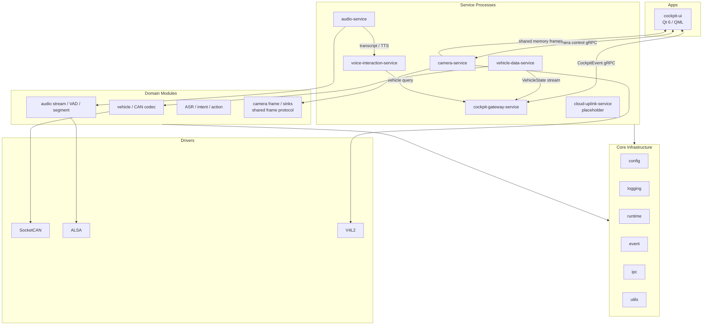
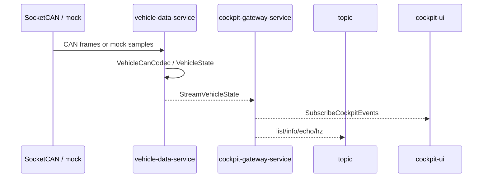

# Smart Cockpit System 架构设计

> 文档版本：v0.4
> 更新日期：2026-07-01
> 项目仓库：`cockpit-system`
> 目标平台：Jetson Orin 系列 / Linux / WSL2
> 语言标准：C++17
> 构建系统：CMake + Ninja

---

## 1. 文档定位

本文档是 `cockpit-system` 的长期架构蓝图和后续演进约束，不是当前实现状态表，也不是一次性实现所有车载能力的愿望清单。
当前代码事实以 [architecture.md](architecture.md) 为准，模块完成度以 [实现状态.md](实现状态.md) 为准，日常推进看板以
[项目进度总览.md](项目进度总览.md) 为准。

项目当前定位：

- 一个 Jetson 车机端主仓库。
- 面向车辆状态、语音交互、音频、摄像头和 Qt/QML HMI。
- 单仓库内部模块化，保留以后按真实部署边界拆库的能力。
- 优先完成单机可运行、可测试、可诊断的链路。
- 云端前后端、完整自动驾驶栈和量产级安全机制不属于当前阶段。

文档优先级：

1. 本文档规定总体边界和长期方向。
2. `docs/architecture.md` 记录当前代码架构快照。
3. `docs/实现状态.md` 记录实际完成度。
4. `docs/项目进度总览.md` 记录日常推进顺序。
5. `docs/变更记录.md` 记录每批代码变更和验证结果。
6. 代码、CMake target 和自动化测试是最终事实来源。

---

## 2. v0.4 主要变化

相对 v0.3，本版本完成以下调整：

1. 从“大量独立微服务”收敛为少量设备所有者进程和进程内模块。
2. 不再规定本机所有数据都通过 gRPC，明确控制面与数据面分离。
3. 通用共享内存基础设施统一放在 `cockpit/core/ipc`。
4. 相机共享内存布局保留在 `cockpit/modules/camera`。
5. 音频 PCM 在进程内通过 SPSC ring buffer 传输。
6. 相机帧通过 POSIX shared memory 双缓冲跨进程传输。
7. Qt UI 已接入车辆状态、相机帧和相机生命周期控制。
8. 新增音频、语音、AI 扩展边界，但不把 mock provider 描述为真实 AI 能力。
9. 将雷达、录像、WebRTC、MQTT、SQLite 和云平台明确标记为后续能力。

---

## 3. 目标与非目标

### 3.1 当前目标

1. 从 SocketCAN 或 mock source 获取车辆状态。
2. 通过 gRPC streaming 将车辆状态聚合到 gateway 和 Qt UI。
3. 使用 ALSA 完成麦克风采集和扬声器播放。
4. 建立 VAD、语音分段、ASR、意图和动作执行流水线。
5. 使用 V4L2 枚举摄像头，使用 GStreamer 采集预览帧。
6. 使用共享内存把 camera-service 帧交给 Qt UI。
7. 提供 CLI、smoke test、日志和配置，支持无硬件开发。
8. 在 Jetson 上通过 systemd 运行核心进程。

### 3.2 非当前目标

- 不构建完整云端平台。
- 不提前拆分云端前端、后端和 shared-proto 仓库。
- 不实现完整 Android 车机系统或双系统虚拟化。
- 不实现自动驾驶感知、规划和控制算法栈。
- 不把音乐播放器、录像研发工具混入语音交互主线。
- 不为尚不存在的模块创建空 target 或空 service。
- 不将视频帧、PCM 或点云直接塞进 gRPC。

---

## 4. 核心原则

### 4.1 单仓库内部模块化

当前保持一个 `cockpit-system` 仓库。目录和 target 按依赖边界拆分，而不是按想象中的组织架构拆库。

只有出现独立部署、独立版本周期、明确维护责任和稳定跨仓库协议时，才考虑拆库。

### 4.2 少量进程，进程内模块化

服务进程只用于真实的资源所有权、故障隔离或部署边界：

- vehicle-data-service 独占车辆数据源。
- audio-service 独占麦克风和扬声器。
- camera-service 独占摄像头。
- cockpit-gateway-service 聚合面向 UI 的数据。
- voice-interaction-service 负责用户语音交互。

VAD、语音分段、ASR adapter、意图解析等能力优先作为进程内模块，不为每一步创建 service。

### 4.3 控制面与数据面分离

| 场景 | 当前方式 | 说明 |
|---|---|---|
| 同线程 | 函数调用 | 最低开销 |
| 同进程低频事件 | callback / EventQueue | 有界生命周期 |
| 音频连续流 | SPSC ring buffer | 单生产者、单消费者 |
| 相机跨进程帧 | POSIX shared memory 双缓冲 | 大块数据本体 |
| 服务控制与状态 | gRPC unary | start/stop/status |
| 车辆状态流 | gRPC server streaming | 小型结构化消息 |
| CLI 调试 | gRPC / 文件 backend | 不进入实时数据面 |
| 未来跨机器 | MQTT / WebSocket / WebRTC | 按真实需求引入 |

规则：

- gRPC 适合控制、状态、文本事件和低频结构化消息。
- 大块连续数据不走 gRPC。
- shared memory 负责数据本体，控制协议负责生命周期和发现。
- 不为了“像微服务”而增加序列化和进程跳转。

### 4.4 硬件适配与领域逻辑分离

- `drivers` 封装 Linux API、设备句柄和第三方硬件库。
- `modules` 保存平台无关模型、codec、pipeline 和领域接口。
- `services` 组合配置、driver、module 与通信接口。
- `apps` 不直接访问 V4L2、ALSA、SocketCAN 或共享内存原始布局。

---

## 5. 当前总体架构



---

## 6. 目录和依赖规则

```text
cockpit-system/
├── cockpit/
│   ├── apps/cockpit-ui/
│   │   ├── vehicle/
│   │   └── camera/
│   ├── core/
│   │   ├── config/
│   │   ├── event/
│   │   ├── ipc/
│   │   ├── logging/
│   │   ├── runtime/
│   │   └── utils/
│   ├── drivers/
│   │   ├── alsa/
│   │   ├── socketcan/
│   │   └── v4l2/
│   ├── modules/
│   │   ├── audio/
│   │   ├── camera/
│   │   ├── can/
│   │   ├── vehicle/
│   │   └── voice/
│   ├── proto/
│   └── services/
├── tests/
├── tools/
└── scripts/
```

### 6.1 `core`

- `config`：类型化 YAML 配置和启动校验。
- `event`：有界进程内事件队列。
- `ipc`：通用 POSIX shared memory 映射生命周期。
- `logging`：统一日志输出。
- `runtime`：参数解析、信号和服务生命周期。
- `utils`：时间等小型基础工具。

禁止放入 `core`：领域模型、硬件访问、相机双槽布局、音频格式、语音意图和临时代码。

### 6.2 `modules`

- `audio`：PCM、WAV、AudioFrame、SPSC、capture stream、VAD、speech segment。
- `camera`：CameraFrame、preview source/sink、latest buffer、相机共享内存布局。
- `can`：平台无关 CAN frame。
- `vehicle`：车辆状态与 CAN codec。
- `voice`：ASR、assistant、action dispatcher 接口和 mock provider。

### 6.3 `drivers`

- `alsa`：PCM capture/playback。
- `socketcan`：CAN socket RAII。
- `v4l2`：设备发现与 capability 查询。

设备树、overlay 和内核模块只在真实 Jetson 硬件需要时加入对应 driver，不进入 WSL 默认构建。

### 6.4 依赖方向

```text
apps / services / tools
        ↓
      modules
        ↓
       core

services / tools
        ↓
      drivers
        ↓
 Linux / hardware APIs
```

- `core` 不依赖上层。
- `modules` 不依赖具体 service。
- service 负责依赖注入和生命周期组合。
- 每个目录声明自己的 CMake target 和直接依赖。

---

## 7. Runtime 与配置

`ServiceRuntime` 当前提供：

- 统一参数解析。
- YAML 配置加载和校验。
- 服务启动/停止日志。
- SIGINT/SIGTERM 停止状态。
- 主循环生命周期。

当前不实现 Actor runtime、动态 `.so` 插件管理器或复杂 scheduler。只有出现动态模块、统一调度或录包回放需求时，再评估 MessageBus、Scheduler、Recorder 和 Monitor。

唯一运行配置入口是 `configs/config.yaml`：

```text
ServiceRuntime
    -> SystemConfig::LoadFromFile()
    -> typed child configs
    -> Validate()
    -> start components
```

相机共享内存配置：

```yaml
services:
  camera:
    frame_transport: shared_memory
    shared_memory_name: /cockpit_camera_preview
    max_frame_bytes: 8388608
    grpc:
      listen_address: 127.0.0.1:50054
```

---

## 8. 车辆数据链路



已实现：mock/SocketCAN source、vcan0 smoke、prototype codec、VehicleState streaming、gateway 最新值、topic 工具和 Qt freshness 状态。

待完成：使用获批 DBC 或信号规范替换 prototype mapping，并完善真车 bus-off/error 策略。

---

## 9. 音频与语音架构

```mermaid
flowchart LR
    MIC[ALSA capture] --> STREAM[AudioCaptureStream]
    STREAM --> FRAME[20 ms AudioFrame]
    FRAME --> RING[SPSC RingBuffer]
    RING --> VAD[VoiceActivityDetector]
    VAD --> SEG[SpeechSegmenter]
    SEG --> ASR[SpeechRecognizer]
    ASR --> INTENT[Intent / Assistant]
    INTENT --> ACTION[ActionDispatcher]
```



固定语音基线：16 kHz、mono、signed PCM16、20 ms frame、continuous stream。

`audio-service` 独占麦克风和扬声器：

- gRPC 负责 start/stop/status/metrics 和文本 Speak。
- PCM 不通过 gRPC。
- transcript 以文本事件 stream 输出。

已实现：非阻塞 ALSA、xrun recovery、Energy VAD、speech segment、mock ASR、可选 whisper.cpp adapter、allowlisted intent、typed ActionDispatcher、车辆状态查询、HMI handoff 和 mock TTS。whisper.cpp small 已在 WSL CPU 完成模型和 adapter 推理验证，中文麦克风与 Jetson CUDA 仍待验证。

边界：

- 用户语音交互不负责研发录包。
- 研发录包、雷达采集和诊断数据属于 recording/diagnostics；当前已实现 VehicleState、轻量事件
  和相机拍照 artifact，音频及连续视频数据源后续接入。
- Android 音乐应用由未来 HMI bridge 控制，不在 C++ 中重造播放器。
- TensorRT、WebRTC VAD 和 LLM provider 尚未实现；whisper.cpp adapter 已完成 WSL CPU
  样例验证，但尚未完成中文麦克风和 Jetson CUDA 验证。

---

## 10. 相机架构

### 10.1 采集和控制

```text
USB camera
  -> V4L2 discovery
  -> GStreamer v4l2src / videoconvert / appsink
  -> CameraPreviewSource
  -> camera-service
```

camera-service gRPC：`ListDevices`、`StartPreview`、`StopPreview`、`GetStatus`。

camera-ctl 和 Qt `CameraControlModel` 使用控制面。当前支持设备选择、640x480/1280x720/1920x1080、30/60 FPS 和启停。

### 10.2 数据面


共享内存分层：

- `cockpit/core/ipc/SharedMemoryRegion`：通用 POSIX mapping RAII。
- `cockpit/modules/camera/shared_memory`：相机 metadata、双槽和 robust process-shared mutex。
- camera-service：writer owner。
- cockpit-ui：reader。

协议规则：

- writer 写非活动槽，完成后切换 active slot。
- generation 与槽内帧对应。
- reader 复制并校验完整帧后释放槽 mutex。
- owner 正常退出时 unlink shared memory。
- owner 异常退出后，新 writer 回收遗留 mapping；robust mutex 修复中断写入状态。
- gRPC 不传视频 payload。

后续：Jetson CSI/NVMM/DMABUF、多 camera channel 和 WebRTC。

---

## 11. Qt/QML HMI

原则：

- QML 只负责展示和交互。
- C++ QObject 提供状态和命令。
- 阻塞 RPC、shared memory 读取和图像转换不在 UI 主线程执行。
- worker 通过 queued invocation 更新 model。

当前对象：

| 对象 | 职责 |
|---|---|
| `VehicleStateModel` | 车辆状态、连接和 freshness |
| `GatewayClient` | 订阅 CockpitEvent |
| `CameraFrameClient` | 后台读取 shared memory |
| `CameraImageProvider` | 向 QML 提供 QImage |
| `CameraFrameModel` | 相机帧属性 |
| `CameraControlModel` | 后台调用 camera gRPC |

页面：Dashboard tab 显示车辆状态；Camera tab 显示设备、参数、启停和实时画面。

Qt 5 不支持。WSL 使用 Qt 6.2.4 验证，Jetson 部署建议固定 Qt 6.8 LTS。

---

## 12. IPC 边界

`cockpit/core/ipc::SharedMemoryRegion` 只负责 POSIX name、`shm_open`、`ftruncate`、`mmap/munmap`、fd 和 owner unlink。

它不负责 CameraFrame、AudioFrame、slot header、ring buffer、领域序列化或服务发现。

当前没有必要实现通用 MessageBus 和 shared-memory allocator。只有多个领域都需要统一 pub/sub、record/replay 和发现时再增加 runtime 层，不能仅因为 CyberRT 或 ROS 2 有这些组件就复制复杂度。

---

## 13. protobuf 与 gRPC

`cockpit/proto/` 保存 common、vehicle、gateway、audio、voice、camera 和 cloud placeholder 契约。

规则：

- protobuf 只表达跨进程稳定契约。
- 内部临时 C++ 类型不必 protobuf 化。
- PCM、图像和点云 payload 不进入控制 RPC。
- enum 保留 UNSPECIFIED。
- streaming client 支持取消、超时和重连。
- 生成文件只进入 `build/`。

---

## 14. 工具和诊断

- `can-simulator`：stdout/SocketCAN。
- `topic`：file/grpc，支持 list/info/echo/hz/pub。
- `audio-probe`：设备、采集、播放和服务控制。
- `voice-ctl`：语音交互控制与状态。
- `camera-probe`：设备和 format。
- `camera-preview-probe`：GStreamer 帧/FPS。
- `camera-ctl`：camera-service list/status/start/stop。

工具是研发诊断接口，不等同于用户产品功能。

---

## 15. 构建、质量和测试

```bash
bash scripts/install_ubuntu_deps.sh
bash scripts/build.sh
bash scripts/run_smoke.sh
```

标准：C++17、`.cc/.h`、CMake + Ninja。构建目录使用
`build/<目标架构>-<debug|release>`；Qt UI 由 `BUILD_COCKPIT_UI` 控制，可选依赖不存在时
不能破坏无关 target。

普通 pre-commit 执行格式和文件检查；clang-tidy 保持手动门禁：

```bash
pre-commit run --all-files
pre-commit run clang-tidy --hook-stage manual -a
```

截至 v0.4，默认构建包含 21 个 CTest，覆盖 IPC、CAN、vehicle、audio、camera、voice、config 和 Qt model。

已验证：vcan0、USB UVC camera probe、30 帧 GStreamer preview、完整 smoke 和 Qt offscreen QML 启动。

---

## 16. 部署模型

当前 Jetson 进程建议：

```text
vehicle-data-service
cockpit-gateway-service
audio-service
camera-service
voice-interaction-service
cockpit-ui
```

`cloud-uplink-service` 当前仅为可选 placeholder。

原则：systemd 管理启动和重启；每个硬件资源只有一个 owner；UI 崩溃不应关闭设备服务；service 重启后 client 应重连；设备权限由部署脚本固定。

---

## 17. 可靠性边界

已考虑：RAII、有界队列、drop metrics、gRPC deadline/cancellation、signal stop、配置校验、mock/null backend、shared memory name/layout/version/capacity 校验。

尚未达到量产要求：认证加密、secure boot、ASIL、watchdog、robust process-shared lock、权限最小化、OTA 回滚和隐私授权。

---

## 18. 后续路线

### 18.1 近期

1. 在真实 USB camera 下验证 Qt 启停、分辨率和 FPS。
2. 为 CameraControlModel 增加 fake gRPC server 测试。
3. 完善 camera-service/UI 重启和 shared-memory reader 重连。
4. 用正式 DBC 或信号表替换 prototype VehicleCanCodec。
5. 在 Jetson 上校准 ALSA 和 VAD threshold。

### 18.2 中期

1. 在 Jetson 上编译 whisper.cpp 并验证真实 ASR 模型，随后接入真实 TTS provider。
2. 增加 wake word 或 push-to-talk UI。
3. 增加 recorder/diagnostics，但与用户语音交互分离。
4. 增加 SQLite 事件/录像索引和 system monitor。

### 18.3 后期可选

1. MQTT 车端上报和小型云端存储/Web 展示。
2. WebSocket 调试页和 WebRTC preview。
3. Jetson CSI/NVMM/DMABUF 零拷贝。
4. 多摄像头、雷达或传感器。
5. 当前 VehicleState 录包复用已有 gRPC stream；当多源同步录包需求出现时，再评估统一
   MessageBus、时间对齐和 recorder runtime。

---

## 19. AI 扩展边界

```text
Audio capture
  -> VAD
  -> Speech segment
  -> ASR provider
  -> Intent / Assistant provider
  -> typed ActionDispatcher
  -> TTS provider
```

- 车辆动作必须经过 allowlist 和 typed validation。
- LLM 文本不能直接变成 CAN frame 或 shell command。
- 网络失败必须有本地 fallback。
- 录音、文本和云端请求必须有隐私策略。
- mock provider 只用于链路测试。

---

## 20. 决策摘要

| 决策 | v0.4 结论 |
|---|---|
| 仓库 | 当前一个主仓库 |
| C++ | C++17 |
| 构建 | CMake + Ninja |
| 本机控制通信 | gRPC + protobuf |
| 音频数据面 | 进程内 SPSC |
| 相机数据面 | POSIX shared memory 双缓冲 |
| 通用 shared memory | `cockpit/core/ipc` |
| 相机内存布局 | `cockpit/modules/camera` |
| UI | Qt 6 / QML |
| CAN | SocketCAN |
| 音频 | ALSA |
| Camera | V4L2 + GStreamer |
| 服务策略 | 少量设备 owner 进程 |
| Runtime | 当前轻量，不做通用 Actor 框架 |
| 云端 | 延后 |
| 录包 | VehicleState recording-service 已实现，独立于 voice；多源录包后续扩展 |

---

## 21. 新代码检查清单

1. 这是基础设施、领域模块、driver、service、app 还是 tool？
2. 是否真的需要新进程？
3. 数据是控制消息、小消息还是连续大块数据？
4. 是否复用了现有 target 和接口？
5. 是否有 mock/null/fake 路径？
6. 是否避免 UI 直接访问硬件？
7. 是否避免把 PCM、图像或点云放进 gRPC？
8. 是否更新 `docs/变更记录.md`？
9. 是否增加与风险相称的测试？
10. 是否通过 build、CTest、pre-commit、clang-tidy 和相关 smoke？

---

## 22. 结论

v0.4 的核心不是增加更多 service，而是把车辆、音频、语音和相机链路放在清晰边界内：

- `core` 提供最小通用基础设施。
- `modules` 保存可复用领域能力。
- `drivers` 隔离 Linux 和硬件。
- 少量 service 持有设备和进程生命周期。
- gRPC 负责控制与结构化状态。
- SPSC 和 shared memory 负责高频数据。
- Qt/QML 通过 C++ model 使用系统能力。

后续功能由真实需求驱动，不以目录数量、service 数量或框架复杂度衡量成熟度。
